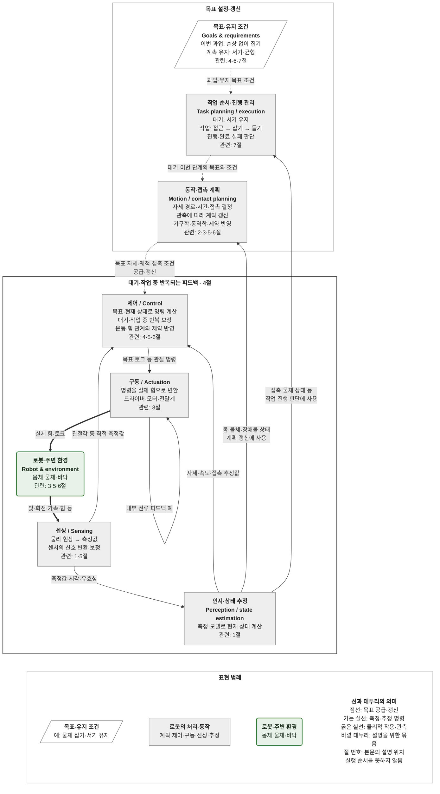

# 휴머노이드는 어떻게 원하는 동작을 만드는가?

[독자와 작성 목적](README.md#audience) · [분야별 개념](concepts.md)

휴머노이드(humanoid)가 선반의 물체를 집어 들어야 한다고 생각해 보자. 물체가 있는 곳까지 손을 옮기고 손가락을 닫으면 될 것 같지만, 손이 닿았다고 물체를 잡은 것은 아니고 물체를 잡았다고 몸이 버틸 수 있는 것도 아니다. 이 글에서는 두 발로 서 있는 로봇이 물체를 보고, 손을 뻗고, 잡아 드는 상황을 따라간다.

아래 전체 연결을 먼저 보고, 이어지는 절에서 각 기능이 필요한 이유를 살펴본다. 예시의 수치와 센서·구동 구성은 원리를 설명하기 위한 가정이며 특정 제품의 사양이 아니다.

## 전체 연결: 목표에서 동작으로, 관측에서 다음 판단으로

위쪽의 **목표 설정·갱신**에서는 무엇을 수행하고 어떤 상태를 유지할지 정한다. 아래쪽의 **대기·작업 중 반복되는 피드백**에서는 그 목표에 맞게 몸을 움직이거나 자세를 유지하며 결과를 측정·보정한다. 관측한 상태는 위쪽에도 돌아가 작업 진행 판단과 재계획에 쓰인다. **제어는 유효한 목표가 주어진 동안 반복하며, 매번 상위에서 새 목표를 받을 필요는 없다.**

상자 안의 **관련 절 번호**는 그 요소를 설명하거나 적용하는 본문의 위치다. 번호는 로봇의 실행 순서를 뜻하지 않는다. 한 절이 여러 요소를 함께 다룰 수 있으며, [7절](#integration)은 전체 연결을 집기 작업에 적용한다.

[연결도 크게 보기](figures/robotics_system_map.svg) · [도식과 1~7절의 대응](#map-to-sections)

범례는 **달성하거나 유지하려는 것**(흰색), **이를 위해 로봇이 하는 일**(회색), **그 과정에서 움직이고 접촉하는 몸체와 주변 환경**(연두색)을 구분한다. 예를 들어 회색의 ‘구동’은 모터가 힘을 만드는 일을, 연두색의 ‘몸체’는 그 힘을 받아 움직이는 팔·다리 등을 나타낸다. ‘센싱’은 물리 현상을 측정값으로 바꾸는 일이다. 상자 안의 **굵은 글씨는 이름**, 일반 글씨는 설명·예시다.

바깥 테두리는 목표 갱신과 반복 피드백을 읽기 쉽게 묶은 것이다. 실제 장치·프로그램의 경계나 실행 주기를 지정하지 않는다. 구동 장치 안에도 전류 제어가 있고, 센싱에는 보정·필터링이 포함될 수 있다. 피드백 영역의 센싱·추정 결과는 계획과 작업 진행 관리에도 쓰인다.

**점선 화살표**는 목표를 공급·갱신하는 관계, **가는 실선 화살표**는 측정·추정 정보나 구동 명령의 전달, **굵은 실선 화살표**는 실제 힘을 가하거나 물리 현상을 관측하는 관계다. 점선은 전달되는 값의 역할을 구분한 것으로, 실행 허가나 특정 갱신 주기를 뜻하지 않는다. 특히 `동작·접촉 계획 → 제어`의 목표 자세·궤적, `제어 → 구동`의 목표 토크, `구동 → 로봇·주변 환경`의 실제 토크는 서로 다르다. 원하는 값을 보냈다고 그 물리적 결과가 그대로 생겼다고 판단할 수는 없다.

### 도식과 1~7절은 어떻게 연결되는가?

도식은 **기능 사이의 관계**, 1~7절은 **그 관계를 이해하기 위한 설명 순서**다. 먼저 상태를 알아내는 방법과 움직임·힘·피드백의 기초를 설명하고, 같은 연결에 접촉과 전신 균형 조건을 더한 뒤 전체 작업을 따라간다.

| 본문 | 도식에서 풀어 설명하는 부분 |
|---|---|
| [1. 위치·상태 파악](#estimation) | **센싱 → 인지·상태 추정**: 측정값의 좌표 기준을 맞추고, 동작 계획·제어에 필요한 현재 상태를 구한다. |
| [2. 자세·움직임 계획](#geometry) | **인지·상태 추정 → 동작·접촉 계획 → 제어**: 현재 상태에서 가능한 자세·경로를 찾고 목표 궤적을 만든다. |
| [3. 힘·구동 능력](#vertical) | **구동 → 로봇·주변 환경**: 명령이 실제 힘과 움직임이 되는 과정과, 그 물리적 한계가 계획·제어에 반영되는 이유다. |
| [4. 반복 측정·보정](#closed-loop) | **제어 → 구동 → 몸·환경 → 센싱·추정 → 제어**: 목표와 실제의 차이를 반복해서 보정하는 고리다. |
| [5. 접촉·파지](#contact) | 손과 물체가 닿을 때 **동작·접촉 계획·제어·센싱·추정**에서 함께 고려해야 하는 힘과 미끄럼 조건이다. |
| [6. 전신 균형](#humanoid) | **로봇·주변 환경**을 팔에서 몸통·다리·바닥까지 넓혀 보고, 계획·제어에 발의 지지와 균형 조건을 반영한다. |
| [7. 집기 작업 통합](#integration) | **작업 순서·진행 관리**가 목표를 주고 관측 결과로 다음 단계를 판단하는 과정에, 1~6절의 전체 연결을 적용한다. |

5·6절은 4절 뒤에 따로 실행되는 기능이 아니다. 같은 피드백과 계획에 **접촉**과 **전신 균형**이라는 조건을 더해 설명하는 절이다. 각 절 첫머리의 ‘도식 연결’에서 해당 상자·화살표로 돌아갈 수 있다.

### 과업이 없어도 유지할 목표가 있다

**서서 대기하기도 제어 목표다.** ‘물체를 집어 들기’는 완료를 판단할 수 있는 과업이고, ‘서 있는 동안 균형 유지’는 계속 만족해야 하는 목표다. 여기서 **유지 목표**(maintenance goal)는 이런 성격을 구분하기 위한 표현이며 별도 장치나 프로그램 이름이 아니다. ‘과업이 없음’은 ‘유효한 제어 목표가 없음’을 뜻하지 않는다.

도식의 같은 연결에서, 대기 중에는 서기 목표가 유효하고 집기 요청이 들어오면 손의 과업 목표가 더해진다. 두 목표는 [6절의 전신 제어](#humanoid)에서 함께 고려된다. 집기를 마친 뒤에도 서기 목표는 남고, 물체를 계속 들고 있어야 한다면 파지 유지도 남는다. 여기서 ‘계속’은 해당 상태가 요구되는 동안을 뜻한다. 앉기나 걷기로 바뀌면 유지할 자세·접촉 조건도 달라진다.

‘서기·균형 유지’는 상위에서 표현한 목표이고, 계획·제어에서는 몸의 자세·질량중심 등의 **목표값**(reference)과 접촉력·관절 토크 등의 **제약**(constraint)으로 구체화한다. 자세를 유지하는 동안에도 측정과 보정이 반복되는 이유는 [4절](#closed-loop)에서 설명한다. 도식의 입력과 기존 계획·제어 상자가 이 역할을 함께 나타낸다.

### 목표를 갱신하는 일과 제어를 반복하는 일

| 그림의 이름 | 결정하는 것 | 물체 집기의 예 |
|---|---|---|
| **작업 순서·진행 관리**(task planning / execution) | 대기·작업에 맞는 목표를 유지·전환하고, 진행 상태로 다음 단계·재시도·중단을 판단한다. | 대기할 때는 서기 목표를 유지하고, 집기 요청이 오면 ‘접근’ 목표를 함께 전달한다. |
| **동작·접촉 계획**(motion / contact planning) | 현재 목표에 필요한 자세·경로·시간·접촉 조건을 정한다. | 물체와 장애물의 위치를 보고 손이 따라갈 목표 궤적을 만든다. |
| **제어**(control) | 목표와 현재 상태를 사용해 구동 명령을 반복 계산한다. | 목표 궤적에 비해 손이 뒤처지면 관절 명령을 보정한다. |

예를 들어 계획이 **2초 동안 손을 이동하는 목표 궤적**을 제공했다고 하자. 제어는 그 궤적에서 **현재 시각에 해당하는 목표**를 꺼내 측정·추정한 상태와 함께 사용하고, 구동 명령을 반복해서 계산한다. 이때 매번 새 궤적을 받을 필요는 없다. 관측 결과 물체 위치가 달라지면 동작 계획을 갱신할 수 있고, 접근 완료 조건이 충족되면 작업 진행 관리가 ‘잡기’ 단계로 넘어간다. 제어의 보정, 계획의 갱신, 작업 단계의 전환은 이처럼 서로 다른 판단이다. [목표와 센서 피드백을 사용하는 제어](https://modernrobotics.northwestern.edu/nu-gm-book-resource/11-1-control-system-overview/)

이 도식은 대표적인 역할과 정보 관계를 보여준다. 실제 구성에서는 작업 관리·계획·제어가 서로 다른 주기로 동작할 수 있으며, 계획을 주기적으로 다시 계산할 수도 있다. 위쪽 상자부터 아래쪽 상자까지 매 제어 주기마다 순서대로 호출해야 한다는 의미는 아니다.

### 제어로 측정값과 추정값이 모두 들어오는 이유

제어에는 목표와 함께 현재 상태가 필요하다. **센싱 → 제어**는 엔코더의 관절각처럼 측정해서 사용할 수 있는 값을, **센싱 → 인지·상태 추정 → 제어**는 몸 전체의 자세·속도처럼 측정과 모델을 결합해 구한 상태를 나타낸다. 여기서 ‘직접 측정값’도 보정·필터링을 거칠 수 있다. [관절 측정값을 사용하는 제어](https://modernrobotics.northwestern.edu/nu-gm-book-resource/11-4-motion-control-with-torque-or-force-inputs-part-1-of-3/) · [관성·기구학·접촉을 결합한 상태 추정](https://arxiv.org/abs/1904.09251)

그림의 제어 상자는 관절 제어·접촉 제어·전신 제어 등을 묶은 표현이다. 모든 제어기가 두 경로를 반드시 따로 받는다는 뜻은 아니며, 측정값과 추정값을 하나의 상태 정보로 묶어 전달할 수도 있다. 구동 상자 안의 전류 피드백은 구동부 내부에도 측정·보정의 반복이 있을 수 있음을 보여준다.

### 모델과 제약은 각 기능에서 어떻게 쓰이는가?

모델은 관계를 계산하는 데 쓰는 표현이고, 제약은 그 계산에서 만족해야 할 조건이다. 기구학·동역학이 각각 순서대로 실행되는 별도 단계인 것처럼 그리지 않고, 사용하는 기능에 설명을 붙였다. 아래는 대표적인 사용 예다.

| 사용하는 기능 | 모델로 계산하는 것 | 함께 반영할 조건 |
|---|---|---|
| 인지·상태 추정 | 좌표 변환과 기구학으로 센서값을 몸의 배치에 연결하고, 관측·운동 모델로 상태를 해석·예측한다. | 센서 오차·측정 시각, 발이 미끄러지지 않는다는 가정 등의 유효성 |
| 동작·접촉 계획 | 기구학으로 도달 가능한 자세를 찾고, 동역학으로 운동에 필요한 힘·토크를 계산한다. | 관절 범위, 충돌 회피, 구동 한계, 손·발 접촉과 균형 조건 |
| 제어 | 관절과 손의 운동·힘 관계 및 현재 상태를 사용해 필요한 입력을 정한다. | 구동 가능한 입력 범위, 접촉 유지, 실행 지연·주기 |
| 구동·센싱 | 모터·전달계 특성으로 명령과 출력의 관계를 계산하거나, 센서 보정 정보로 신호를 물리량으로 바꾼다. | 출력·발열 한계, 센서 측정 범위와 유효성 |

균형·파지·접촉은 여러 기능에 걸친 문제다. 예를 들어 계획은 발을 지지한 채 손을 어디로 보낼지 정하고, 제어는 손의 움직임과 발의 접촉력을 함께 조절하며, 센싱·추정은 그 접촉이 유지되는지 알려준다. 전신 제어는 이런 목표와 조건을 함께 다루는 접근이다. [추정·계획·전신 제어의 통합 사례](https://dspace.mit.edu/entities/publication/6cb6cad7-9288-419c-aa5a-cc44744f2e91)

## 1. 물체를 보았는데, 손을 어디로 보내야 할까?

> **도식 연결:** [전체 연결도](#system-map)의 **센싱 → 인지·상태 추정**을 중심으로, 그 결과가 동작 계획과 제어에 쓰이기까지를 설명한다.

### 영상 속 위치를 몸의 위치와 연결하기

카메라 영상에서 물체를 찾았다고 하자. 영상의 가로·세로 몇 번째 픽셀에 보이는지는 알 수 있지만, 그것만으로 물체가 손에서 몇 cm 떨어져 있는지는 알 수 없다. 작은 물체가 가까이 있는 것과 큰 물체가 멀리 있는 것이 비슷하게 보일 수도 있다. 공간 속 위치를 구하려면 깊이 센서, 여러 시점의 영상, 물체 크기에 관한 지식 등 추가 정보가 필요하다.

거리까지 얻어도 기준을 맞춰야 한다. 카메라에서 말하는 ‘앞으로 30 cm’와 어깨에서 말하는 ‘앞으로 30 cm’는 출발점이 다르다. 머리가 돌아가면 카메라가 보는 앞쪽 방향도 달라진다. **좌표계**(coordinate frame)는 이렇게 위치를 재는 원점과 축의 방향을 정한 기준이다. 손과 물체의 거리를 계산하려면 두 위치를 같은 좌표계로 표현해야 한다.

예를 들어 어깨와 카메라의 앞쪽 축이 나란하고 카메라가 어깨보다 20 cm 앞에 있다고 하자. 물체가 카메라에서 30 cm 앞에 있다면 어깨에서는 50 cm 앞이다. 카메라가 회전했다면 거리만 더할 수 없고 축의 방향 변화도 반영해야 한다. 이것이 좌표 변환이 필요한 이유다.

**위치**(position)가 ‘어디에 있는가’라면 **방향**(orientation)은 ‘어느 쪽을 향하는가’다. 둘을 합친 배치를 **포즈**(pose)라고 부른다. 물체를 옆에서 잡을지 위에서 잡을지 정하려면 위치뿐 아니라 방향도 필요하다. [좌표계 사이의 위치·방향 변환](https://modernrobotics.northwestern.edu/nu-gm-book-resource/3-3-1-homogeneous-transformation-matrices/)

### 센서가 읽은 값과 로봇이 알아야 할 상태

로봇은 자기 몸의 상태도 알아야 한다. 팔꿈치가 얼마나 굽혀졌는지는 관절의 회전량을 읽는 **엔코더**(encoder)로 측정할 수 있다. 하지만 모든 관절각이 같아도 몸 전체가 앞으로 기울거나 바닥에서 미끄러질 수 있다. 관절각만으로는 세계 안에서 몸이 어디에 있는지 알 수 없는 이유다. 몸의 위치·방향·속도를 구할 때는 카메라, 회전 속도와 가속도 관련 정보를 측정하는 **관성 측정 장치**(inertial measurement unit, IMU), 발의 접촉 정보 등을 함께 사용할 수 있다. [기구학·관성·접촉을 결합한 상태 추정 사례](https://arxiv.org/abs/1904.09251)

이때 **측정값**(measurement)은 센서가 내놓은 값이고, **상태 추정값**(state estimate)은 측정과 모델을 해석해 구한 현재 상태다. 대상이 그대로여도 측정값이 흔들리는 **잡음**(noise)이 생기거나, 카메라 시야에서 물체가 가려질 수 있다. 필요한 상태를 직접 측정하지 못할 수도 있다. 예를 들어 ‘발이 바닥에서 미끄러지지 않는다’는 가정을 쓰면 관절 움직임으로 몸의 움직임을 추정하는 데 도움을 얻지만, 실제로 발이 미끄러지면 그 가정을 다시 판단해야 한다. 추정값과 함께 오차가 어느 정도일지, 언제 측정한 값인지도 중요해진다.

이런 일을 묶어 **인지**(perception)와 **상태 추정**(state estimation)이라고 한다. 인지는 물체·장애물 등 주변의 의미와 구조를 알아내는 데, 상태 추정은 다음 판단에 필요한 로봇·물체의 상태를 구하는 데 초점을 둔다. 두 영역의 경계는 구현에 따라 겹친다. 이 사례에서 다음 단계로 넘길 것은 단순한 ‘물체 검출 성공’이 아니라, **같은 기준으로 표현된 물체와 몸의 위치·방향, 그리고 그 정보의 시각과 신뢰 정도**다.

지도와 그 안에서 움직이는 로봇의 상태를 함께 구하는 **동시 위치 추정 및 지도 작성**(simultaneous localization and mapping, SLAM), 같은 물체의 상태를 관측 사이에서 이어가는 **물체 추적**(object tracking)도 추정을 사용한다. 다만 지도 속 로봇의 위치와 집을 물체의 위치는 서로 다른 정보다. [추정 용어 보충](concepts.md#estimation)

## 2. 손이 닿는 자세와, 그곳까지 가는 움직임은 어떻게 구할까?

> **도식 연결:** [전체 연결도](#system-map)의 **인지·상태 추정 → 동작·접촉 계획 → 제어** 중, 현재 상태에서 목표 궤적을 만드는 부분이다.

이제 물체가 손에서 어디에 있는지 안다고 하자. 로봇 팔은 길이와 형태를 가진 몸체 부분인 **링크**(link)와, 링크 사이의 움직임을 허용하는 **관절**(joint)로 이루어져 있다. 어깨나 팔꿈치 관절이 돌아가면 손의 위치도 바뀐다. 회전 관절의 각도를 모아 `q = [어깨각, 팔꿈치각, …]`처럼 표현하면 현재 팔의 **관절 구성**(joint configuration)을 나타낼 수 있다.

팔의 길이와 관절 구성을 알 때 손이 어디에 놓이는지 계산하는 것이 **정기구학**(forward kinematics, FK)이다. 입력은 관절각 등 구성을 나타내는 변수이고, 출력은 기준 좌표계에서 본 손의 위치·방향이다. 반대로 ‘손을 물체 옆에 이 방향으로 놓고 싶다’는 목표에서 필요한 관절 구성을 찾는 것이 **역기구학**(inverse kinematics, IK)이다. 이런 몸의 구조와 움직임의 기하학적 관계를 다루는 분야가 **기구학**(kinematics)이다.

같은 손 위치에 도달해도 팔꿈치를 위로 들거나 옆으로 벌린 자세가 가능할 수 있다. 어떤 자세는 선반과 부딪히고, 어떤 자세는 관절이 움직일 수 있는 각도 범위를 넘는다. 물체가 너무 멀면 가능한 자세 자체가 없다. 따라서 IK의 결과는 ‘목표를 만족하는 자세 후보’이지, 곧바로 실행해도 되는 동작 명령은 아니다. [정기구학과 역기구학의 관계, 해의 존재와 다중성](https://modernrobotics.northwestern.edu/nu-gm-book-resource/inverse-kinematics-of-open-chains/)

목표 자세가 가능해도 **그곳까지 가는 중간 과정**을 찾아야 한다. 손을 직선으로 옮기면 선반 모서리를 통과할 수 있고, 손은 피했지만 팔꿈치가 부딪힐 수도 있다. 시작 구성에서 목표 구성까지 몸 전체가 장애물과 자기 몸을 피하도록 움직임을 찾는 것이 **동작 계획**(motion planning)의 문제다. 그중 **경로**(path)는 어떤 구성들을 어떤 순서로 지나갈지를 나타낸다. [동작 계획의 문제와 제약](https://modernrobotics.northwestern.edu/nu-gm-book-resource/10-1-overview-of-motion-planning/)

경로만으로는 실행 시각이 정해지지 않는다. 같은 경로를 1초에 지나갈 수도, 3초에 지나갈 수도 있다. 시간에 따른 목표 구성을 정한 것이 **궤적**(trajectory)이다. 위치가 시간에 따라 변하는 정도가 **속도**(velocity), 속도가 변하는 정도가 **가속도**(acceleration)다. 직선 운동에서는 각각 m/s, m/s²를 쓰고, 관절의 회전 운동에서는 각도와 그 변화량을 사용한다. 출발할 때 빨라지고 도착하기 전에 느려지는 과정까지 정해야 실제 몸에 요구되는 움직임을 알 수 있다.

그런데 왜 실행 시간을 마음대로 줄일 수 없을까? 그 답은 다음의 힘과 구동 능력에 있다. [궤적과 시간 계획](https://modernrobotics.northwestern.edu/nu-gm-book-resource/9-4-time-optimal-time-scaling-part-1-of-3/)

## 3. 가능한 자세인데, 왜 실제로는 버티거나 움직이지 못할까?

> **도식 연결:** [전체 연결도](#system-map)의 **구동 → 로봇·주변 환경**을 설명하고, 필요한 힘과 구동 한계가 계획·제어를 제한하는 이유를 살펴본다.

### 물체를 몸에서 멀리 들면 더 버티기 어려운 이유

같은 물체도 몸 가까이 들 때보다 팔을 앞으로 뻗어 들 때 어깨가 더 힘들다. 물체가 갑자기 무거워진 것은 아니다. 아래로 당기는 힘이 어깨를 중심으로 팔을 돌리려는 효과가 커졌기 때문이다. 이 회전 효과를 **토크**(torque)라고 한다. 밀거나 당기는 **힘**(force)의 단위는 N(뉴턴), 토크의 단위는 N·m(뉴턴미터)다.

팔이 한 평면에서 회전하는 경우, 그 회전축 주위 토크의 크기는 다음처럼 생각할 수 있다.

`토크 τ = 힘 F × 회전축에서 힘의 작용선까지의 수직거리 d`

여기서 `τ`(타우)는 토크[N·m], `F`는 힘[N], `d`는 거리[m]다. 질량이 약 1 kg인 물체는 지구 중력 아래에서 약 10 N의 힘으로 아래로 당겨진다. 팔을 수평으로 뻗어 물체를 팔을 들어 올리는 어깨 축에서 0.3 m 떨어진 곳에 들면, 물체 때문에 생기는 토크는 약 `10 × 0.3 = 3 N·m`다. 거리가 0.1 m라면 약 1 N·m로 줄어든다. 이 계산은 팔 자체의 무게를 제외하고 정지한 상태에서 물체가 주는 효과만 본 것이다. 실제 어깨는 팔의 무게가 만드는 토크도 함께 감당해야 한다. [토크와 힘의 작용 거리](https://openstax.org/books/university-physics-volume-1/pages/10-6-torque)

따라서 **손이 닿는가와 그 자세를 유지할 수 있는가는 다른 질문**이다. 모터가 만들 수 있는 토크보다 필요한 토크가 크면, 기하학적으로 가능한 자세여도 그대로 버틸 수 없다. 팔을 접거나 몸을 가까이 옮기면 요구되는 토크가 달라진다.

### 움직임을 시작하고 멈출 때 추가로 필요한 것

[2절](#geometry)에서는 기구학으로 관절각과 손의 위치 관계를 구하고, 경로·궤적으로 원하는 움직임을 정했다. 이제는 **그 움직임을 실제로 만들려면 힘과 토크가 얼마나 필요한가**를 따져야 한다. 같은 팔이 같은 궤적을 따라 움직여도, 빈손일 때와 물체를 들었을 때 필요한 토크는 달라진다.

기구학(kinematics)은 몸의 형상과 위치·속도·가속도의 관계를 다룬다. 여기에 로봇과 물체의 질량·관성, 중력 등의 영향을 함께 고려해 **움직임과 힘·토크의 관계**를 다루는 것이 **동역학**(dynamics)이다. 따라서 기구학적으로 가능한 움직임을 실제로 수행할 수 있는지 판단하려면, 동역학으로 필요한 힘·토크를 계산하고 구동 능력과 비교해야 한다.

정지한 자세를 유지하는 것에 더해, 움직임을 바꾸는 데도 힘이 필요하다. **질량**(mass)은 같은 힘을 받았을 때 직선 운동을 바꾸기 어려운 정도를 나타내는 양이며 단위는 kg이다. **관성**(inertia)은 운동 상태의 변화를 거스르는 성질이며, 회전에서는 질량이 회전축에서 얼마나 멀리 분포하는지도 중요하다. 같은 팔도 접었을 때와 뻗었을 때 회전 속도를 바꾸는 데 필요한 토크가 달라진다.

손을 더 짧은 시간에 출발시키고 멈추려면 보통 더 큰 가속·감속이 필요하다. 그러면 중력을 버티는 토크 외에 운동을 바꾸는 토크도 고려해야 한다. 이처럼 원하는 위치·속도·가속도에서 필요한 힘과 토크를 계산하는 문제를 **역동역학**(inverse dynamics)이라고 한다. [로봇 운동과 필요한 관절 토크](https://modernrobotics.northwestern.edu/nu-gm-book-resource/8-3-newton-euler-inverse-dynamics/)

계획에 필요한 토크가 너무 크면 시간을 늘려 가속도를 줄이는 방법을 검토할 수 있다. 다만 **천천히 움직인다고 중력을 버티는 토크까지 없어지지는 않는다.** 정지 상태부터 감당하지 못하는 자세라면 속도 조절만으로 해결되지 않으며 자세나 경로, 물체를 드는 방법을 바꿔야 한다. 하위 구동 능력이 상위 동작 계획을 제한한다는 말은 이런 뜻이다.

### SW 명령을 실제 힘으로 바꾸는 구동부

**구동기**(actuator)는 에너지를 실제 힘과 움직임으로 바꾼다. 전기 모터(motor)를 쓰는 구성에서는 모터 드라이버(motor driver)가 전류를 조절하고 모터가 토크를 만든다. ‘관절을 이 위치로 이동하라’는 SW 명령이 몸을 바로 옮기는 것은 아니다. 그 아래에서 필요한 전기 입력과 토크를 만드는 과정이 있어야 한다. [제어기·모터 드라이버·구동기의 관계](https://modernrobotics.northwestern.edu/nu-gm-book-resource/11-1-control-system-overview/)

모터는 빠르게 돌지만 필요한 토크가 부족할 수 있다. **감속기**(speed reducer)는 출력의 회전 속도를 낮추는 대신 토크를 높인다. 손실을 무시한 10:1 감속을 예로 들면 출력 속도는 모터의 1/10, 토크는 10배가 된다. 에너지를 새로 만드는 장치는 아니며, 실제로는 **마찰**(friction) 등의 손실이 있다. 마찰은 접촉한 부분 사이의 상대 운동이나 미끄러지려는 경향을 방해하는 작용이다. 감속 정도와 구조는 외부 힘에 대한 움직임에도 영향을 주므로, 구동부는 토크뿐 아니라 필요한 속도와 접촉 시 응답까지 고려해 선택한다. [감속과 동적 특성](https://modernrobotics.northwestern.edu/nu-gm-book-resource/8-9-actuation-gearing-and-friction/)

## 4. 움직임을 정했는데, 왜 계속 측정하고 보정해야 할까?

> **도식 연결:** [전체 연결도](#system-map)의 **대기·작업 중 반복되는 피드백** 전체를 설명한다. 제어로 돌아오는 직접 측정값과 추정값도 이 고리의 일부다.

계획에는 로봇과 물체의 모델이 사용되지만, 실제 물체의 질량이나 관절 마찰을 완벽하게 알기는 어렵다. 센서값에도 오차가 있고 움직이는 동안 외부에서 힘이 가해질 수 있다. 따라서 계획한 궤적을 보내는 것만으로 몸이 그대로 움직인다고 보장할 수 없다.

한 관절을 예로 들어 보자. 궤적에서 지금 시각의 목표 각도가 60°인데 센서로 읽은 각도가 55°라면 **추종 오차**(tracking error)는 `60° − 55° = 5°`다. **제어**(control)는 목표와 측정·추정한 상태를 비교해 구동 입력을 조정한다. 토크를 명령하는 구성이라면 목표를 향하도록 토크를 조절하고, 움직인 뒤의 각도를 다시 측정한다. 이처럼 결과를 다음 입력에 반영하는 것이 **피드백**(feedback)이다.

오차가 같아도 현재 속도에 따라 필요한 입력은 달라진다. 55°에서 멈춘 관절과 빠르게 60°를 향해 움직이는 관절을 똑같이 밀면, 후자는 목표를 지나칠 수 있다. 각도 오차뿐 아니라 목표 속도와 실제 속도의 차이도 사용하는 대표적인 방법이 **비례·미분 제어**(proportional-derivative control, PD)다. 또한 물체를 든 채 목표 각도에 멈췄더라도 중력을 버티는 토크는 계속 필요하다. 목표에 도착했다고 입력을 모두 없애면 팔이 처질 수 있다. 그래서 중력을 버티는 입력을 모델로 미리 계산해 더하고, 실제 상태와의 차이를 피드백으로 보정하는 구성을 사용할 수 있다. [관절 토크를 입력으로 하는 제어](https://modernrobotics.northwestern.edu/nu-gm-book-resource/11-4-motion-control-with-torque-or-force-inputs-part-1-of-3/)

목표가 바뀌지 않아도 이 보정은 필요하다. 예를 들어 관절의 목표 각도를 60°로, 목표 속도를 0으로 두고 그 상태를 유지할 수 있다. 이런 **고정 목표값 제어**(setpoint control)에서는 매번 새 이동 명령을 받지 않고 현재 각도·속도의 오차를 반복해서 보정한다. 서서 대기하는 로봇도 목표 자세와 균형을 유지하도록 몸을 조절한다. 다만 전신 균형은 관절각만 각각 고정한다고 확보되는 것이 아니므로, [6절](#humanoid)의 몸 전체와 접촉 조건을 함께 고려해야 한다. [고정 목표값을 사용하는 PD 제어](https://modernrobotics.northwestern.edu/nu-gm-book-resource/11-4-motion-control-with-torque-or-force-inputs-part-1-of-3/)

이 반복 관계를 **폐루프**(closed loop)라고 한다. [전체 연결도](#system-map)에서 `제어 → 구동 → 로봇·주변 환경 → 센싱 → 추정 → 제어`로 돌아오는 고리가 여기에 해당한다. 물체 위치가 달라지거나 예상한 움직임이 불가능해지면 추정 결과를 받아 계획 자체도 바뀔 수 있다. 피드백이 있다고 물리적으로 불가능한 목표까지 가능해지는 것은 아니다. [폐루프의 기본 구조](https://modernrobotics.northwestern.edu/nu-gm-book-resource/11-1-control-system-overview/)

여기서 **측정 시각과 실행 시각**도 동작의 일부다. 이미 목표 각도를 지나친 관절에 과거의 55° 값을 기준으로 계속 전진 명령을 주면 잘못된 보정이 될 수 있다. 측정부터 입력이 반영될 때까지의 **지연**(latency), 실행 간격의 흔들림인 **지터**(jitter)가 중요한 이유다. **실시간**(real-time)은 평균적으로 계산이 빠르다는 뜻을 넘어, 필요한 결과가 정해진 시간 안에 쓰일 수 있어야 한다는 요구다. 모든 계획·센싱·제어가 같은 주기로 실행되는 것은 아니다. [실시간 시스템의 시간 제약](https://design.ros2.org/articles/realtime_background.html) · [제어 개념 보충](concepts.md#control)

## 5. 손이 물체에 닿으면 무엇이 달라질까?

> **도식 연결:** [전체 연결도](#system-map)에서 손과 물체의 접촉을 중심으로 **동작·접촉 계획·제어·센싱·추정**이 함께 달라지는 부분을 본다.

공중에서 손을 움직일 때는 목표 위치에 가까워지는 것이 자연스러운 목표다. 하지만 물체 표면에 닿은 뒤에는 상황이 달라진다. 추정한 표면 위치가 실제보다 조금 안쪽에 있다면, 손은 이미 닿았는데도 위치 제어기는 ‘아직 목표에 못 갔다’고 판단할 수 있다. 계속 위치 오차를 줄이려 하면 물체를 더 누르는 힘이 생긴다. 위치 오차가 작다는 사실만으로 접촉력이 적절하다고 말할 수 없는 이유다.

**접촉력**(contact force)은 닿은 물체 사이에서 주고받는 힘이다. 손가락으로 물체의 양옆을 잡아 들어 올리는 경우를 보자. 손가락은 물체를 옆에서 누르지만, 접촉면의 마찰은 물체가 아래로 미끄러지려는 것을 위쪽으로 버텨준다. 단순한 마찰 모델에서는 누르는 힘이 작으면 버틸 수 있는 미끄럼 방향의 힘도 작아진다. 그렇다고 무조건 세게 누르면 물체가 찌그러질 수 있다. **파지**(grasping)는 닿을 위치와 손 모양뿐 아니라 접촉력과 물체·표면의 특성을 함께 고려하는 문제다. [접촉력과 마찰의 관계](https://modernrobotics.northwestern.edu/nu-gm-book-resource/12-2-1-friction/)

접촉을 조절하는 **상호작용 제어**(interaction control)에는 여러 접근이 있다. **힘 제어**(force control)는 원하는 접촉 힘을 만드는 데 초점을 둔다. **임피던스 제어**(impedance control)는 손이 목표에서 밀려났을 때 얼마나 강하게 되밀 것인지 등 운동과 힘 사이의 관계를 정한다. 스프링처럼 적게 밀리면 약하게, 많이 밀리면 강하게 저항하도록 동작을 구성하는 것이 한 가지 직관이다. 실제 제어에서는 움직임을 가라앉히는 감쇠 등도 함께 고려한다. [위치 제어에서 힘·임피던스 제어로](https://manipulation.mit.edu/force.html)

이 구분은 센싱과도 연결된다. 손가락 관절각은 손이 얼마나 닫혔는지를, 힘·촉각 정보는 어디에 어떻게 접촉했는지를 판단하는 데 쓰인다. 각도만으로 물체를 잡았는지 확정하기는 어렵고, 접촉이 있다는 사실만으로 들어 올리는 동안 미끄러지지 않을 것까지 보장할 수도 없다. 센싱(sensing)과 상태 추정은 명령의 실행 여부뿐 아니라 **원하는 물리적 결과가 생겼는지**를 판단하는 데도 필요하다. [힘 센싱과 제어의 관계](https://modernrobotics.northwestern.edu/nu-gm-book-resource/11-5-force-control/)

## 6. 팔로 물체를 드는데, 왜 몸통과 다리까지 고려할까?

> **도식 연결:** [전체 연결도](#system-map)의 **로봇·주변 환경**을 팔에서 몸통·다리·바닥까지 넓혀 보고, 이를 함께 고려하는 계획·제어를 설명한다.

책상에 단단히 고정한 로봇 팔이라면 고정부가 팔에서 전달되는 힘과 토크를 받아줄 수 있다. 두 발로 선 휴머노이드는 몸통이 고정되어 있지 않다. 팔을 앞으로 뻗거나 물체를 들면 몸 전체의 질량 분포와 필요한 지지력이 바뀐다. 어깨 모터가 충분히 강해도 발과 바닥이 그 동작을 지지할 수 있는지는 따로 봐야 한다.

몸 전체 질량의 분포를 하나의 대표 위치로 나타낸 것이 **질량중심**(center of mass, CoM)이다. 몸통이 무거우면 그쪽의 영향이 크고, 팔을 뻗거나 물체를 들면 로봇과 물체를 합친 질량중심도 달라진다. **지지 영역**(support polygon)은 평평한 바닥에서 발이 닿은 부분들을 바깥쪽으로 둘러싼 영역으로 생각할 수 있다. 두 발이 모두 닿아 있으면 그 사이도 포함하고, 한 발을 들면 남은 발의 접촉 영역으로 줄어든다.

우선 평평한 바닥에 두 발을 나란히 딛고 가만히 서 있으며, 중력과 발 접촉 외에는 외부 힘이 없다고 가정하자. 이 자세를 유지하려면 중력이 아래로 당기는 힘과 바닥이 위로 밀어주는 힘이 균형을 이루어야 한다. 여기에 **몸을 돌리려는 효과인 토크도 서로 상쇄되어야 한다.** 상쇄한다는 것은 반대 방향의 회전 효과가 서로를 없애, 토크의 합이 0이 된다는 뜻이다.

질량중심 바로 아래의 바닥 위치가 지지 영역 안에 있으면, 발바닥에서 받는 힘의 분포를 조절해 **그 힘들을 합친 효과가 질량중심 바로 아래에서 위로 떠받치는 것**과 같아지게 할 수 있다. 그러면 아래로 당기는 중력과 위로 받치는 힘의 크기뿐 아니라 작용선도 맞출 수 있다. 같은 선을 따라 반대 방향으로 작용하므로, 두 힘이 만드는 토크도 서로 상쇄된다.

이제 로봇을 옆에서 보고, 몸을 앞으로 기울여 **질량중심이 발 앞끝보다 앞으로 나온 경우**를 생각해 보자. 발 앞끝을 회전의 기준으로 잡으면, 중력은 그 기준보다 앞에 있는 질량중심을 아래로 당긴다. 그 결과 몸을 발끝 너머로 넘어뜨리는 방향의 토크가 생긴다. [3절의 토크 설명](#vertical)에서 본 것처럼, 이 토크의 크기는 중력의 크기와 발끝에서 중력의 작용선까지의 수평 거리에 따라 커진다.

하지만 바닥이 위로 밀어줄 수 있는 곳은 발끝 또는 그 뒤의 접촉 부분뿐이다. **발끝 바로 아래에서 밀면 그 점을 기준으로 한 토크가 0이고, 발끝 뒤에서 위로 밀면 몸을 앞으로 넘어뜨리는 방향의 토크가 된다.** 시소의 한쪽을 위로 올리거나 반대쪽을 아래로 누르면 같은 방향으로 도는 것과 같다. 따라서 바닥이 위로 밀어주는 힘만으로는 중력의 토크를 반대 방향에서 없앨 수 없다. 이것이 ‘중력이 만드는 회전 효과를 상쇄할 수 없다’는 뜻이다.

가만히 서서 버티려면 몸통·다리 자세를 바꿔 질량중심이 지지 영역 위에 오게 하거나, 발을 앞으로 내디뎌 받치는 영역을 바꿔야 한다. 이는 **멈춘 자세를 유지하는 조건**이며, 걷거나 빠르게 움직일 때는 가속도와 회전 운동까지 함께 고려해야 한다. [질량중심·접촉력과 보행의 관계](https://underactuated.mit.edu/humanoids.html)

발은 바닥을 누를 수 있지만 보통 바닥을 붙잡아 당길 수는 없고, 마찰이 허용하는 것보다 큰 옆 방향 힘을 요구하면 미끄러질 수 있다. **균형**(balance)을 유지하려면 몸의 목표 움직임이 이런 접촉 조건 안에서 가능해야 한다. 한 발을 떼는 순간에는 그 발이 지지력을 제공하지 못하므로, 발을 언제 어디에 놓을지 정하는 **발디딤 계획**(footstep planning)도 몸의 움직임과 연결된다. [접촉이 동작에 주는 제약](https://underactuated.mit.edu/contact.html)

**전신 제어**(whole-body control, WBC)는 손의 작업, 몸통의 움직임, 발의 접촉 같은 여러 목표와 제약을 함께 고려해 몸 전체의 제어 입력을 정하는 접근이다. 대기 중에는 서기 목표를 유지하고, 집는 동안에는 손의 목표와 균형 유지를 동시에 고려한다. 이때 균형을 유지한다는 것은 모든 관절을 같은 각도로 고정한다는 뜻이 아니다. 손을 앞으로 보내면서 몸통·다리 자세와 발에 가해지는 힘을 함께 조절할 수 있다. [상태 추정·계획·전신 제어를 통합한 Atlas 연구 사례](https://dspace.mit.edu/entities/publication/6cb6cad7-9288-419c-aa5a-cc44744f2e91)

목표끼리 충돌할 때의 **우선순위**(priority)는 ‘서기를 끝낸 다음 집기’라는 실행 순서가 아니라, 함께 수행하는 목표 중 무엇을 먼저 보존할지 정하는 기준이다. 예를 들어 이 집기 상황에서는 균형 조건을 지키기 위해 손의 목표 위치를 조정하거나 계획을 바꾸도록 설계할 수 있다. 엄격한 우선순위로 하위 목표를 제한하는 방법과 **가중치**(weight)로 목표 간 오차를 절충하는 방법은 다르다. 반드시 지켜야 하는 조건을 **제약**으로 두는 것 역시 큰 가중치를 주는 것과 같지 않다. 어떤 방식으로 목표·제약을 표현하는지는 제어 설계에 따라 달라진다. [TALOS 전신 제어 비교 연구의 우선순위·가중치·제약 구분](https://www.frontiersin.org/journals/robotics-and-ai/articles/10.3389/frobt.2022.826491/full)

보행 설명에서 만나는 영 모멘트 점(zero moment point, ZMP) 등의 용어는 이 관계를 더 정밀하게 표현할 때 쓰인다. 질량중심·접촉·지지의 관계를 먼저 이해한 뒤 [접촉과 균형의 개념](concepts.md#contact)에서 이어 읽을 수 있다.

## 7. 같은 집기 동작에서 실제로 무엇이 이어지는가?

> **도식 연결:** [전체 연결도](#system-map)의 **작업 순서·진행 관리**에서 시작해 목표 전달과 반복 피드백을 모두 따라간다. 1~6절의 개념을 같은 집기 작업에 적용한다.

이번 예에서는 로봇이 서서 대기하다가 ‘물체를 손상 없이 집어 들기’라는 작업 목표를 받고, 작업 순서·진행 관리가 **접근 → 잡기 → 들기**의 단계를 정한다고 하자. 접근 위치·방향, 파지 상태, 들기 높이 등 단계별로 확인할 조건도 정해 두었다고 가정한다. 서기·균형 유지 목표는 대기와 집기 작업 전반에 걸쳐 유효하다.

각 단계의 목표는 **작업 순서·진행 관리 → 동작·접촉 계획 → 제어**로 전달된다. 대기·작업 중 **센싱 → 인지·상태 추정**의 결과가 제어뿐 아니라 동작 계획과 작업 진행 관리에도 돌아간다. 아래 표는 이 관계를 작업 상황별로 풀어 쓴 것이며, 측정과 제어는 각 행마다 한 번씩 실행되는 것이 아니라 대기·작업 중 계속 반복된다.

| 진행 상황 | 도식의 요소가 하는 일 | 다음에 쓰이는 결과 |
|---|---|---|
| **과업 없이 서서 대기** | **작업 순서·진행 관리**는 서기 목표를 유지한다. **계획**에서 정한 목표 자세·접촉 조건을 사용해 **제어·구동·센싱·추정**이 보정을 반복한다. [4절](#closed-loop) · [6절](#humanoid) | 새 과업이 없어도 현재 상태에 맞는 구동 명령이 계속 계산된다. |
| **작업 시작·이번 단계 결정** | **작업 순서·진행 관리**가 전체 목표와 현재 상태를 바탕으로 ‘접근’ 단계를 선택한다. | **동작·접촉 계획**에 기존 서기·균형 유지 목표와 함께 이번 단계의 목표·조건을 전달한다. |
| **물체와 몸의 상태 파악** | **센싱·인지·상태 추정**이 영상·관절각·몸의 움직임을 해석하고 좌표 기준을 맞춘다. [1절](#estimation) | 물체·손·몸의 위치와 장애물 정보는 **계획**에, 현재 상태는 **제어**에, 단계 진행 판단에 필요한 상태는 **작업 순서·진행 관리**에 쓰인다. |
| **접근 움직임 준비** | **동작·접촉 계획**이 기구학으로 가능한 자세·경로를 찾고, 필요한 토크·충돌 회피·발의 지지 조건을 검토한다. [2절](#geometry) · [3절](#vertical) · [6절](#humanoid) | **제어**가 따라갈 목표 궤적·접촉 조건. 조건을 만족하지 못하면 자세·경로·실행 시간을 다시 정한다. |
| **접근 실행·잡기 단계로 전환** | **제어·구동**이 손과 몸을 움직이고 **센싱·추정**이 결과를 되돌린다. **작업 순서·진행 관리**는 관측된 위치·방향 등이 접근 완료 조건을 만족하는지 판단한다. [4절](#closed-loop) | 완료로 판단하면 **동작·접촉 계획**에 ‘잡기’ 목표를 전달한다. 궤적을 보냈다는 사실만으로 다음 단계에 진입하지 않는다. |
| **파지 형성·들기 단계로 전환** | **계획·제어**가 손가락의 움직임과 접촉을 다루고 **센싱·추정**이 파지·미끄럼 판단에 필요한 상태를 구한다. **작업 순서·진행 관리**가 들기 단계로 진행할 조건을 확인한다. [5절](#contact) | 파지와 진행 조건이 충족됐다고 판단하면 ‘들기’ 목표를 전달한다. 근거가 부족하면 현재 단계 유지나 재시도 등을 판단한다. |
| **물체 들기·작업 완료 판단** | **계획·제어**가 물체의 하중과 전신 균형을 함께 고려하고 **구동**이 실제 힘을 만든다. **작업 순서·진행 관리**는 관측된 물체 위치·파지·몸 상태 등으로 정해 둔 완료 조건을 확인한다. [3절](#vertical) · [6절](#humanoid) | 완료 조건을 충족하면 집기 작업을 완료로 판단한다. 이후 물체를 든 채 대기한다면 서기·파지 유지 목표와 피드백은 계속 유효하다. |
| **어느 단계에서든: 예상과 다른 결과** | 물체 위치·장애물 상태가 달라지면 **동작·접촉 계획**이 움직임을 갱신한다. 진행이 어렵거나 실패했다면 **작업 순서·진행 관리**가 현재 단계 유지·재시도·중단 등을 판단한다. | 판단에 따라 계획과 제어에 전달되는 목표를 갱신한다. 이는 유효한 목표를 따라 반복하는 제어 보정과 구별된다. |

예를 들어 손이 목표보다 조금 뒤처지는 것은 **제어의 보정**, 물체가 옮겨져 접근 경로를 바꾸는 것은 **동작 계획의 갱신**, 접근을 마치고 잡기로 넘어가는 것은 **작업 단계의 전환**에 해당한다. 1~6절에서 설명한 상태·움직임·힘·접촉·균형이 이 세 판단의 근거로 함께 쓰인다.

여기서 명령과 실제 결과를 구분해야 한다. 예를 들어 ‘목표 토크 3 N·m’를 보냈다는 사실이 그 토크가 정확히 나왔다는 뜻은 아니다. 센서와 모델로 확인한 상태가 다시 돌아와야 실제 결과에 맞춰 다음 입력을 바꿀 수 있다. 마찬가지로 손의 목표 궤적을 모두 실행했다는 사실만으로 물체를 성공적으로 들었다고 판단할 수는 없다.

기술 선택도 이 연결을 따라 검토할 수 있다. 집기 시간을 줄이려면 더 빠른 궤적을 검토하지만, 필요한 토크나 접촉 조건을 만족하지 못하면 시간을 늘리거나 자세를 바꿔야 한다. 무게를 버티는 힘 자체가 부족하다면 속도를 줄이는 것만으로 해결되지 않는다. **상위 목표가 하위 요소에 요구를 주고, 하위 한계가 가능한 동작을 다시 제한한다.**

그림은 이 작업을 이해하기 위한 기능 분해다. 실제 구현에서는 계획과 제어를 묶어 계산하거나, 학습된 **정책**(policy)이 관측에서 동작 명령을 만들 수도 있다. 그 경우에도 어떤 관측을 입력으로 받고 무엇을 명령하며, 실제 몸과 접촉에 어떤 한계가 있는지를 확인할 수 있다. [학습 기반 휴머노이드 보행 사례](https://arxiv.org/abs/2404.05695)

로봇의 동작을 설명할 때는 지금 보는 값이 **관측한 상태인지, 앞으로의 목표인지, 구동 명령인지, 실제 물리적 결과인지**를 먼저 구분하면 된다. 그다음 이 값이 어느 좌표계·시각·단위로 표현되며 다음 기능에서 어떻게 쓰이는지 연결한다. 이 구분을 같은 집기 상황에 적용하는 과정은 [적용 사례: 손은 닫혔는데 왜 물체를 놓쳤을까?](platform_robot_walkthrough.md)에서 이어 읽을 수 있다.
